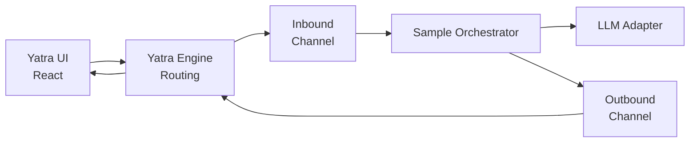

# Yatra Sample Application

## Technical Design Specification

**Author:** Sivakumar Angarai  
**Version:** 0.1  
**Status:** Historical initial build specification  
**Purpose:** Provide an implementation-ready specification for a small Yatra shell that demonstrates asynchronous conversation, LLM interaction, and dynamically defined forms.

> This document records the original design baseline. The final Version 1 behavior is defined by the documents under `docs/`, particularly `Architecture.md`, `Message-Protocol.md`, and `Persistence.md`.

## 1. Objective

Build a small working application that validates the fundamental Yatra communication model:

- The Yatra UI is a React application running in a browser.
- The Yatra Engine is an ASP.NET Core application running on the server.
- The engine moves messages between the browser and an orchestration agent.
- The engine connects to the orchestration agent only through a stable agent-adapter contract.
- The concrete agent adapter is selected in the server composition root at compile/build time.
- Inbound and outbound messages pass through separate in-memory queues.
- The orchestration agent answers simple questions through an LLM.
- The orchestration agent produces a few predefined dynamic forms.
- A submitted form identifies the original form message using `inReplyTo`.
- The engine resolves the original message's server-side return path and routes the reply to the proper requester.
- The Yatra architecture permits skills to request forms directly, without asking the orchestration agent to create or forward them.
- Version 0.1 implements only the orchestration-agent form-request path; no skill runtime is included in this sample.

The first release is an architectural sample, not a production-ready agent platform.

### Scope distinction

The **platform design** recognizes the orchestration agent and skills as independent form requesters. Both use the same Yatra messaging, pending-reply, and return-path mechanism. The **version 0.1 implementation**, however, contains only one requester: the configured orchestration agent. Direct skill requests are a required extension path but are not to be implemented in the first version.

## 2. Design Principles

1. **The engine is a traffic post.** It transports, correlates, and routes messages. It does not decide business behavior.
2. **Everything exchanged is a message.** User text, agent text, forms, form responses, status updates, and errors use a common envelope.
3. **The UI does not know internal return paths.** It receives a message ULID and replies using `inReplyTo`.
4. **Routing is explicit on the server.** A reply-expected message is registered with a return path before it is sent to the UI.
5. **Forms are definitions, not server-rendered HTML.** React maps approved definition types to trusted UI components.
6. **Form origin is unrestricted.** The orchestration agent generates forms in the sample. A skill may also request a form directly and receive its reply without the orchestration agent participating in that exchange.
7. **Asynchrony is visible in the architecture.** Queue producers and consumers do not depend on immediate replies.
8. **The sample remains small.** Persistence, distributed queues, production identity, and sophisticated agent planning are deferred.
9. **The engine is agent-neutral.** No agent-specific SDK, prompt model, protocol, or response type may leak into the engine, queue, routing, or UI contracts.

## 3. Selected Technology Stack

| Area | Technology | Purpose |
| --- | --- | --- |
| Browser | React with TypeScript | Conversation and dynamic-form UI |
| Build tooling | Vite | Simple React development and build |
| Server | ASP.NET Core Web API | Yatra Engine host |
| Browser delivery | Server-Sent Events (SSE) | One-way server-to-browser message stream |
| Browser submission | HTTP POST | User text and form replies |
| Memory queues | `System.Threading.Channels` | Inbound and outbound asynchronous queues |
| Agent connection | Compile-time registered adapter interface | Allows the same Yatra Engine to work with different orchestration agents |
| Identifiers | ULID | Unique, time-sortable message and invocation identifiers |
| Serialization | `System.Text.Json` | Shared JSON wire format |
| Validation | Server validators plus React field validation | Validate envelopes and form responses |
| Tests | xUnit and React Testing Library/Vitest | Server and UI verification |

The browser uses ordinary HTTP POST requests to send messages to the engine and holds one SSE connection open to receive messages from the engine. The internal message contracts remain transport-neutral.

## 4. Logical Architecture



The diagram shows the initial sample only. In the full architecture, a skill may publish a form request directly through the same engine-facing messaging abstraction. The engine registers the skill's return path and routes the user's response directly back to that skill invocation.

## 5. Suggested Solution Structure

```text
yatra-sample/
  README.md
  docs/
    technical-design.md
  src/
    Yatra.Contracts/
      Messages/
      Forms/
      Routing/
    Yatra.Engine/
      Api/
      Streaming/
      Queues/
      Routing/
      Sessions/
      Program.cs
    Yatra.AgentIntegration/
      IOrchestrationAgentAdapter.cs
      AgentInput.cs
      AgentOutput.cs
    Yatra.Orchestration/
      SampleOrchestrationAgentAdapter.cs
      Commands/
      Forms/
      Llm/
      OrchestrationWorker.cs
    yatra-ui/
      src/
        api/
        components/
        forms/
        messages/
        models/
        state/
  tests/
    Yatra.Engine.Tests/
    Yatra.Orchestration.Tests/
    yatra-ui.tests/
```

### Project responsibilities

- `Yatra.Contracts`: Transport-neutral contracts shared by server components. Do not place runtime routing services here.
- `Yatra.Engine`: Browser POST endpoints, SSE stream endpoint, queues, pending-reply registry, correlation, and delivery.
- `Yatra.AgentIntegration`: Agent-neutral port and normalized input/output contracts used by the engine.
- `Yatra.Orchestration`: Sample commands, predefined forms, LLM adapter, and orchestration behavior.
- `yatra-ui`: Conversation surface, message renderer, form renderer, and client connection state.
- `tests`: Contract, routing, orchestration, and rendering tests.

## 6. Common Message Envelope

All browser/server and internal application messages use the following logical envelope.

```json
{
  "messageId": "01K4Y8M2J7V6R3N9B5QX1TACDE",
  "conversationId": "01K4Y8J0VEXAMPLE00000000000",
  "type": "form.request",
  "source": "orchestrator:sample",
  "destination": "ui:current-conversation",
  "createdAtUtc": "2026-09-09T20:00:00Z",
  "inReplyTo": null,
  "expectsReply": true,
  "payload": {}
}
```

### Required fields

| Field | Requirement |
| --- | --- |
| `messageId` | Required ULID; unique for every message |
| `conversationId` | Required ULID; stable for one conversation |
| `type` | Required registered message-type string |
| `source` | Required internally; the UI may receive a sanitized value |
| `destination` | Required internally; may be omitted from the public UI payload |
| `createdAtUtc` | Required UTC timestamp |
| `inReplyTo` | Required for a response; otherwise null |
| `expectsReply` | True only when a later response is expected |
| `payload` | Type-specific JSON object |

`messageId` and `inReplyTo` provide message correlation. A separate correlation identifier is unnecessary for the initial sample. It may be added later for workflows that span multiple branches.

## 7. Message Types

The initial registry shall contain:

| Type | Direction | Purpose |
| --- | --- | --- |
| `user.text` | UI to server | User-entered conversational text |
| `agent.text` | Server to UI | Orchestrator or LLM response |
| `form.request` | Server to UI | Dynamic form definition |
| `form.response` | UI to server | Submitted or cancelled form |
| `status` | Server to UI | Processing or connection status |
| `error` | Either | Structured recoverable error |

Unknown types shall not crash a queue consumer. The engine shall log the issue and create an `error` message when a user-visible response is possible.

## 8. Server-Side Return Path

### Requirement

Any message that expects a reply must have a server-side return path registered before delivery to the UI.

```csharp
public sealed record ReturnPath(
    string RequesterType,
    string RequesterId,
    string InvocationId,
    string ReplyDestination);

public sealed record PendingReply(
    string RequestMessageId,
    string ConversationId,
    ReturnPath ReturnPath,
    DateTimeOffset CreatedAtUtc,
    DateTimeOffset ExpiresAtUtc,
    PendingReplyStatus Status);
```

### Registry

Define an `IPendingReplyRegistry` abstraction with operations equivalent to:

```csharp
RegisterAsync(PendingReply pendingReply)
ResolveAsync(string requestMessageId, string conversationId)
CompleteAsync(string requestMessageId)
CancelAsync(string requestMessageId)
ExpireAsync(DateTimeOffset now)
```

The first implementation may use `ConcurrentDictionary<string, PendingReply>` keyed by the request message ULID.

### Routing rules

1. Before delivering a reply-expected message, register its message ULID and return path.
2. Send only the message ULID and displayable definition to the browser.
3. The browser creates a new ULID for its reply and sets `inReplyTo` to the original message ULID.
4. The engine resolves the pending entry using `inReplyTo` and verifies the conversation ID.
5. The engine affixes the resolved return path to the internal response.
6. The engine routes the response to `ReplyDestination`.
7. After accepted submission or cancellation, mark the pending entry completed.
8. Reject duplicate, expired, missing, or cross-conversation responses.

The browser must never be trusted to provide or modify an internal return path.

## 9. Dynamic Form Contract

### Form request payload

```json
{
  "formId": "access-request",
  "formVersion": "1.0",
  "title": "Application Access Request",
  "description": "Provide the requested access details.",
  "submitLabel": "Submit",
  "cancelLabel": "Cancel",
  "fields": [
    {
      "id": "application",
      "type": "select",
      "label": "Application",
      "required": true,
      "options": [
        { "value": "finance", "label": "Finance" },
        { "value": "operations", "label": "Operations" }
      ]
    },
    {
      "id": "justification",
      "type": "textarea",
      "label": "Business justification",
      "required": true,
      "maxLength": 500
    }
  ]
}
```

### Initially supported field types

- `text`
- `textarea`
- `number`
- `date`
- `select`
- `checkbox`

Each field shall have an `id`, `type`, `label`, and `required` property. Optional constraints may include `minLength`, `maxLength`, `min`, `max`, `pattern`, `placeholder`, and `options` where appropriate.

### Safety boundary

The form definition shall be declarative. It shall not contain HTML, JavaScript, executable expressions, or arbitrary component names. React shall render only types from an explicit component registry.

### Form response payload

```json
{
  "messageId": "01K4Y8N8P2F4S6H1C9D3WQZBKM",
  "conversationId": "01K4Y8J0VEXAMPLE00000000000",
  "type": "form.response",
  "createdAtUtc": "2026-09-09T20:02:00Z",
  "inReplyTo": "01K4Y8M2J7V6R3N9B5QX1TACDE",
  "expectsReply": false,
  "payload": {
    "formId": "access-request",
    "formVersion": "1.0",
    "action": "submit",
    "values": {
      "application": "finance",
      "justification": "Month-end reporting"
    }
  }
}
```

`action` shall initially support `submit` and `cancel`.

## 10. Queue Design

Define independent abstractions:

```csharp
public interface IInboundMessageQueue
{
    ValueTask WriteAsync(YatraMessage message, CancellationToken cancellationToken);
    IAsyncEnumerable<YatraMessage> ReadAllAsync(CancellationToken cancellationToken);
}

public interface IOutboundMessageQueue
{
    ValueTask WriteAsync(RoutableMessage message, CancellationToken cancellationToken);
    IAsyncEnumerable<RoutableMessage> ReadAllAsync(CancellationToken cancellationToken);
}
```

Use bounded `Channel<T>` instances with configurable capacity. Define an explicit full-queue policy; for the sample, `Wait` is preferred so messages are not silently dropped.

Queue consumers shall:

- Run as ASP.NET Core hosted services.
- Honor cancellation tokens.
- Catch and log failures per message.
- Continue processing after a recoverable message failure.
- Avoid blocking calls such as `.Result` and `.Wait()`.

The in-memory queues intentionally lose contents on server restart. This limitation must be stated in the sample README.

## 10.1 Orchestration Agent Connection

### Architectural requirement

The Yatra Engine shall not reference the sample orchestration agent directly. It shall depend only on an agent-neutral interface owned by `Yatra.AgentIntegration`.

```csharp
public interface IOrchestrationAgentAdapter
{
    string AgentType { get; }

    Task HandleAsync(
        AgentInput input,
        IAgentOutputSink output,
        CancellationToken cancellationToken);
}

public interface IAgentOutputSink
{
    ValueTask PublishAsync(
        AgentOutput output,
        CancellationToken cancellationToken);
}
```

`AgentInput` shall contain the normalized Yatra message and, when applicable, the server-resolved return path. `AgentOutput` shall contain a normalized Yatra message plus an optional return path when the output expects a reply.

The adapter is responsible for translating between Yatra's normalized contracts and the selected agent's native API, SDK, event model, or invocation format. Agent-native types must remain inside the adapter implementation.

### Compile-time selection

Exactly one primary orchestration-agent adapter shall be registered in the server composition root for the initial sample:

```csharp
services.AddSingleton<IOrchestrationAgentAdapter,
    SampleOrchestrationAgentAdapter>();
```

To build Yatra with another orchestration agent, a developer implements `IOrchestrationAgentAdapter` and changes only the dependency-injection registration:

```csharp
services.AddSingleton<IOrchestrationAgentAdapter,
    AlternateAgentAdapter>();
```

This is compile/build-time composition. The browser user cannot choose or replace the orchestration agent at runtime in version 0.1.

### Connection flow

1. The inbound worker reads a normalized message from the inbound channel.
2. It passes an `AgentInput` to the registered `IOrchestrationAgentAdapter`.
3. The adapter invokes its underlying orchestration agent.
4. The agent may produce zero, one, or several outputs asynchronously.
5. The adapter normalizes each output and sends it through `IAgentOutputSink`.
6. The output sink registers return-path metadata when a reply is expected.
7. The output sink writes the normalized message to the outbound channel.

The engine shall not assume that an agent invocation produces exactly one immediate response.

### Adapter invariants

Every adapter shall:

- Accept normalized Yatra inputs.
- Preserve message and conversation identifiers where applicable.
- Convert agent output into registered Yatra message types.
- Supply a server-side return path for every output expecting a reply.
- Receive routed replies through the invocation identified by that return path.
- Honor cancellation and timeouts.
- Prevent agent-specific internal data from entering the public UI contract.

The adapter may communicate with a local object, an agent SDK, another process, or a remote agent service. Those differences must not alter the Yatra Engine contract.

## 11. Browser Session and Delivery

Browser-to-engine and engine-to-browser communication shall use separate HTTP paths:

```text
POST /api/conversations/{conversationId}/messages
GET  /api/conversations/{conversationId}/events
```

The POST endpoint accepts `user.text` and `form.response` messages and places validated messages on the inbound queue. The GET endpoint returns `Content-Type: text/event-stream` and remains open so the engine can deliver outbound messages asynchronously.

The engine shall maintain a mapping between `conversationId` and its active SSE stream subscription. The outbound worker resolves the destination conversation and publishes the message to that stream.

Recommended behavior:

- The UI creates or restores a conversation ULID for the browser tab.
- The UI opens an `EventSource` connection to the conversation's SSE endpoint.
- Each SSE event uses the Yatra message ULID as its SSE `id` and the Yatra message type as its SSE `event` value.
- The complete public Yatra message is serialized in the SSE `data` field.
- The server periodically sends a lightweight heartbeat comment to keep idle connections alive.
- The browser automatically reconnects if the SSE connection is interrupted.
- Reconnection re-establishes the conversation stream subscription.
- The server verifies that submitted messages belong to the registered conversation.

Because version 0.1 uses only memory queues and has no outbound-message store, it does not guarantee replay of messages missed during a disconnection. `Last-Event-ID` may be logged, but durable replay is deferred. This limitation must be documented in the README.

### SSE endpoint requirements

- Set `Content-Type` to `text/event-stream` and `Cache-Control` to `no-cache`.
- Disable response buffering where the ASP.NET Core hosting stack permits it.
- Write each event using standard SSE `id`, `event`, and `data` lines followed by a blank line.
- Flush the response after every complete Yatra message.
- Use `HttpContext.RequestAborted` to stop the stream and remove its subscription.
- Emit only complete Yatra messages in version 0.1; token-by-token LLM streaming is deferred.
- Do not treat an SSE delivery acknowledgment as completion of a reply-expected interaction. Completion occurs only when the corresponding response is accepted.

For the sample, anonymous conversations are acceptable. Do not treat a client-supplied conversation ULID or possession of the SSE URL as authorization in a production system.

## 12. Yatra Engine Processing

### User text

1. UI creates a `user.text` message.
2. Engine validates its envelope and conversation.
3. Engine writes it to the inbound channel.
4. Orchestration worker reads it and processes the request.

### Outbound text

1. Orchestrator creates an `agent.text` message.
2. It writes the message to the outbound channel.
3. Outbound worker writes it to the conversation's active SSE stream.

### Outbound form

1. Orchestrator creates a `form.request` and a return path.
2. Engine registers the pending reply using the form message ULID.
3. Engine places or accepts the message on the outbound channel.
4. Outbound worker sends the public form message to the UI.

### Form response

1. UI sends a `form.response` containing `inReplyTo`.
2. Engine validates the envelope and payload.
3. Engine resolves `inReplyTo` in the pending-reply registry.
4. Engine verifies the conversation and pending state.
5. Engine attaches the internal return path.
6. Engine sends the response to the return path's reply destination.
7. Requester processes the response and creates a result message.

## 13. Sample Orchestration Behavior

The first orchestrator uses deterministic command matching to keep the sample understandable.

| User phrase | Behavior |
| --- | --- |
| `show contact form` | Send predefined contact form |
| `request application access` | Send predefined access-request form |
| `confirm an action` | Send predefined confirmation form |
| Anything else | Send the text to the configured LLM |

Matching may be case-insensitive and tolerate leading/trailing whitespace. It does not need intent classification in version 0.1.

### Sample forms

1. **Contact form:** name, email, subject, and message.
2. **Access request:** application, role, justification, and access end date.
3. **Confirmation:** explanatory text with Confirm and Cancel actions.

After a form reply, the orchestrator returns a short confirmation showing that the response reached the correct invocation. Avoid returning sensitive field values.

## 14. LLM Adapter

Define an abstraction so the engine and orchestrator do not depend on one provider:

```csharp
public interface ILlmClient
{
    Task<string> AskAsync(
        string conversationId,
        string userText,
        CancellationToken cancellationToken);
}
```

Provide:

- A configured LLM implementation for simple questions.
- A deterministic fake implementation for tests and local operation without credentials.
- Timeout and cancellation handling.
- A friendly `error` message when the LLM is unavailable.

Do not give the LLM control over form schemas in version 0.1. Forms are predefined by the sample orchestrator.

## 15. React UI Design

### Main layout

The first screen contains:

- Conversation history panel
- Message composer
- Send button
- Connection/processing status
- Inline dynamic-form cards in chronological message order

### Message renderer

Use a registry keyed by message type:

```text
agent.text     -> TextMessage
user.text      -> UserMessage
form.request   -> DynamicForm
status         -> StatusMessage
error          -> ErrorMessage
```

Unknown message types should render a safe unsupported-message notice during development and be logged.

### Form renderer

The renderer shall:

- Map each approved field type to a React component.
- Maintain values and validation state locally.
- Disable repeat submission while a response is being sent.
- Display field-level validation messages.
- Send `inReplyTo` using the original form message ULID.
- Mark the form completed or cancelled after server acceptance.
- Prevent editing after completion in the initial sample.

## 16. Validation

Validate at both UI and server boundaries.

Server validation shall include:

- Valid ULIDs.
- Known message type.
- Required envelope fields.
- Known form and form version.
- Response fields permitted by that form definition.
- Required values and field constraints.
- `inReplyTo` exists and points to a pending request.
- Pending request belongs to the same conversation.
- Pending request is not completed, cancelled, or expired.

The server is authoritative even when the React form has already validated the response.

## 17. Error Model

Use a structured payload:

```json
{
  "code": "pending_reply_not_found",
  "message": "The requested interaction is no longer available.",
  "retryable": false,
  "relatedMessageId": "01K4Y8M2J7V6R3N9B5QX1TACDE"
}
```

Initial error codes:

- `invalid_message`
- `unsupported_message_type`
- `invalid_form_definition`
- `invalid_form_response`
- `pending_reply_not_found`
- `pending_reply_expired`
- `duplicate_response`
- `conversation_mismatch`
- `llm_unavailable`
- `delivery_failed`

Internal exception details and return paths shall not be sent to the browser.

## 18. Logging and Diagnostics

Use structured logging with:

- Message ID
- Conversation ID
- Message type
- Direction
- Queue name
- Requester type and ID on internal logs only
- Processing duration
- Outcome or error code

Do not log complete form values or LLM content by default. The sample may include a developer-mode message inspector that shows safe envelope metadata without exposing server-side return paths.

## 19. Security Boundaries

Even for the sample:

- Never render HTML or execute code from a form definition.
- Never accept a return path from the browser.
- Verify `conversationId` when resolving `inReplyTo`.
- Limit message and field lengths.
- Limit the number of fields and options in a form.
- Do not expose LLM credentials to React.
- Keep secrets in server configuration or environment variables.
- Configure CORS only for the known development UI origin.

Authentication, user authorization, durable ownership, and multi-tenant isolation are deferred but required before production use.

## 20. Configuration

Recommended settings:

```json
{
  "Yatra": {
    "InboundQueueCapacity": 100,
    "OutboundQueueCapacity": 100,
    "PendingReplyLifetimeMinutes": 30,
    "SseHeartbeatSeconds": 15,
    "MaxMessageTextLength": 8000,
    "MaxFormFields": 25,
    "MaxSelectOptions": 100
  },
  "Llm": {
    "Provider": "Fake",
    "TimeoutSeconds": 30
  }
}
```

Do not commit API keys or provider secrets.

## 21. Testing Requirements

### Contract tests

- Serialize and deserialize every message type.
- Reject missing or invalid ULIDs.
- Verify TypeScript examples conform to the server JSON contract.

### Routing tests

- Register and resolve a return path by message ULID.
- Route a valid response to the correct requester invocation.
- Reject a response from another conversation.
- Reject duplicate, expired, and unknown replies.
- Confirm that return-path data is absent from the public UI message.

### Browser delivery tests

- Verify the SSE endpoint returns `text/event-stream`.
- Verify each outbound message uses its ULID as the SSE event ID.
- Verify outbound messages are isolated by conversation ID.
- Verify cancellation closes and removes the stream subscription cleanly.
- Verify heartbeat comments do not appear as conversation messages.

### Agent-adapter tests

- Confirm that the engine depends only on `IOrchestrationAgentAdapter`.
- Substitute a fake adapter without changing engine code.
- Verify that one input may produce zero, one, or multiple asynchronous outputs.
- Verify translation of an adapter form request into a normalized `form.request`.
- Verify that a form reply is delivered to the invocation represented by the resolved return path.
- Add an architecture test that prevents `Yatra.Engine` from referencing the concrete sample-agent project.

### Queue tests

- Preserve message order for a single producer.
- Process inbound and outbound messages asynchronously.
- Continue after a recoverable processing error.
- Stop cleanly on cancellation.

### Orchestration tests

- Each sample command produces the correct form.
- An ordinary question calls `ILlmClient`.
- Each form response reaches the invocation that requested it.
- Cancel produces the expected cancellation response.

### UI tests

- Render every supported message type.
- Render every initial field type.
- Enforce required-field validation.
- Submit a response with the correct `inReplyTo`.
- Prevent duplicate submission.
- Render server errors safely.

### End-to-end tests

1. Ask an ordinary question and receive an LLM/fake-LLM answer.
2. Request the contact form, submit it, and receive confirmation.
3. Open two forms and submit them in reverse order; each response reaches the correct invocation.
4. Attempt to submit the same form twice and receive a duplicate-response error.
5. Submit a response with a mismatched conversation ID and verify rejection.

The reverse-order test is essential because it demonstrates that routing depends on `inReplyTo`, not on the most recently displayed form.

## 22. Implementation Sequence for Codex

### Phase 1: Contracts and queues

- Create the solution and project structure.
- Add message, form, return-path, and error contracts.
- Add ULID generation and validation.
- Implement inbound and outbound `Channel<T>` queues.
- Add contract and queue tests.
- Add the agent-neutral adapter and output-sink contracts.

### Phase 2: Engine routing

- Implement the pending-reply registry.
- Implement inbound and outbound hosted workers.
- Add the browser POST endpoint and SSE delivery endpoint.
- Add conversation stream registration, heartbeat, disconnection cleanup, and reconnection handling.
- Add routing, expiration, duplicate, and conversation tests.
- Connect the inbound worker only to the registered `IOrchestrationAgentAdapter`.

### Phase 3: Sample orchestrator

- Add deterministic command recognition.
- Implement `SampleOrchestrationAgentAdapter` as the compile-time-selected adapter.
- Add three predefined form factories.
- Route form responses back to the correct invocation.
- Add the fake and configured LLM adapters.

### Phase 4: React UI

- Build the conversation layout.
- Connect to the engine.
- Add the message-renderer registry.
- Add the safe dynamic-form renderer.
- Add submission state and error handling.

### Phase 5: End-to-end verification

- Run all automated tests.
- Verify simultaneous forms and reverse-order submission.
- Verify reconnect behavior.
- Document startup configuration and known limitations.

Codex should complete and test one phase before proceeding to the next. It should not introduce skills, tools, persistence, authentication, or distributed messaging during the initial build.

## 23. Definition of Done

The sample is complete when:

1. The React UI and ASP.NET Core server start with documented commands.
2. A user can send a normal question and receive an asynchronous response.
3. The three sample commands display valid dynamic forms.
4. Form definitions are rendered only through the approved React component registry.
5. A form response contains `inReplyTo` but no return path.
6. The server resolves and affixes the correct return path internally.
7. Two outstanding forms can be answered in either order and reach their correct requesters.
8. Invalid, duplicate, expired, and cross-conversation replies are rejected safely.
9. Unit, integration, UI, and required end-to-end tests pass.
10. The README clearly states that queues and pending replies are lost on restart.
11. Replacing the sample agent requires only a new adapter implementation and a change to dependency-injection registration.
12. `Yatra.Engine` has no project reference to the concrete sample orchestration implementation.

## 24. Deferred Extension Model

The Yatra architecture shall support `IYatraRequester`, or an equivalent addressable endpoint abstraction, for orchestration agents and skills. The version 0.1 code does not implement a skills runtime, but its engine contracts and return-path model must not prevent this extension.

Each requester will be able to:

- Publish text or interactive messages.
- Supply a return path when it expects a reply.
- Receive a routed response at the specified invocation.
- Continue independently after receiving the response.

When skills are added, a skill may either define and request its own form directly or ask the orchestration agent for assistance. A direct skill form request does not pass through the orchestration agent. The engine treats agent and skill requests identically: register the requester-provided return path, deliver the form, resolve `inReplyTo`, affix the stored return path, and route the response to the original requester.

This preserves the initial Yatra principle: the engine manages message traffic, while agents, skills, and tools determine what interaction is needed.

### Version 0.1 boundary

Codex shall build only:

- One compile-time configured orchestration-agent adapter.
- Forms requested by that orchestration agent.
- The generic return-path and reply-routing mechanism.

Codex shall not build a skill loader, skill registry, skill execution host, or sample skills in version 0.1. The direct-skill form path is documented now so that these later additions can reuse the same mechanism without redesigning the engine or UI.
